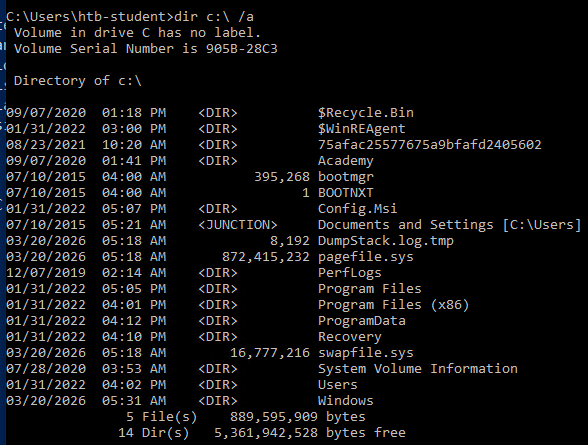
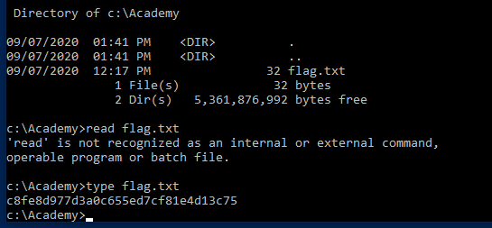

# starting windows fundamentals: 

- getting windows information :
  - `Get-WmiObject -Class  Win32_OperatingSystem | select`
    but they can be different, like Win32_Service (list services) or Win32_Process (list Processes) or Win32_Bios, quite everything is what i understand it is.

- there is multiple ways to connect to a windows machine (ssh in later version, 2019+), and there's rdp (connect via freerdp or remmina..).
- rdp runs by default on port 3389, the rdp application is mstsc.exe.
- we can connect with : `xfreerdp /v:"ip" /u:"username" /p:"password"`.
- lets try the lab:\
    \
    ok i connected:\
    let's get the build number, it should be by the command : `Get-WmiObject -Class Win32_OperatingSystem | select`\
    \
    there goes the build number\
    and now the windows NT version, which is obviously 10 as you can see

- let's continue learning, now the operating system structure, skipping to important stuff, the Users folder, contains Default, and Public folders, Default is more like a template so whenever a new user is created it's based on the Default, the Public folder is accessible by all users and its like a place to share files, it's also shared over the network by default.
- application data and settings per user are stored in AppData (minecraft mods ya3t), 
- System, System32, SysWOW64 contain DLLs required for windows and the windows api, when programs ask to load a dll, the OS searches for it in these folders by default.
- WinSxS : windows component store, contains a copy of all windows components updates and service packs ().

- ok now time for some cmd (i know nothing about it  hh)
- well there's quite alot of commands we'll get to them, the lab currently ask for listing with dir (equivalent to ls), and there's tree too, let's follow the lab : "Find the non-standard directory in the C drive. Submit the contents of the flag file saved in this directory." ok:\
    \
    its the Academy folder lets list whats inside of it\
    \
    done