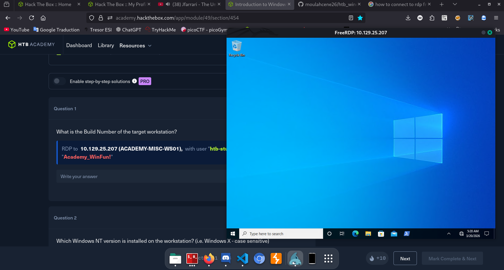
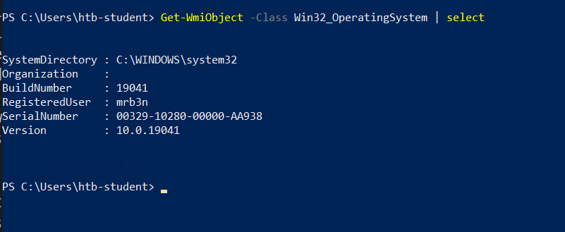

# starting windows fundamentals: 

- getting windows information :
  - `Get-WmiObject -Class  Win32_OperatingSystem | select`
    but they can be different, like Win32_Service (list services) or Win32_Process (list Processes) or Win32_Bios, quite everything is what i understand it is.

- there is multiple ways to connect to a windows machine (ssh in later version, 2019+), and there's rdp (connect via freerdp or remmina..).
- rdp runs by default on port 3389, the rdp application is mstsc.exe.
- we can connect with : `xfreerdp /v:"ip" /u:"username" /p:"password"`.
- lets try the lab:\
    \
    ok i connected:\
    let's get the build number, it should be by the command : `Get-WmiObject -Class Win32_OperatingSystem | select`\
    \
    there goes the build number\
    and now the windows NT version, which is obviously 10 as you can see

- let's continue learning, now the operating system structure, 